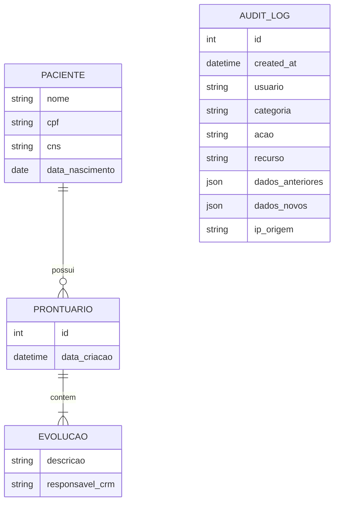

# Modelo de Dados e Dicionário

## 1. Modelo Entidade-Relacionamento


## 2. Dicionário de Dados
* Tabelas: `PACIENTES`, `PRONTUARIOS`, `REFRESH_TOKENS`, `AUDIT_LOGS`.

### [SCHEMA] Esquema JSON - AuditLog
```json
{
  "$schema": "http://json-schema.org/draft-07/schema#",
  "title": "AuditLog",
  "type": "object",
  "properties": {
    "usuario": { "type": "string" },
    "categoria": { "type": "string", "enum": ["SEGURANCA", "NEGOCIO_CLINICO", "CONFIGURACAO"] },
    "acao": { "type": "string" },
    "recurso": { "type": "string" },
    "dados_anteriores": { "type": ["object", "null"] },
    "dados_novos": { "type": ["object", "null"] },
    "ip_origem": { "type": ["string", "null"] }
  },
  "required": ["usuario", "categoria", "acao", "recurso"]
}
```

### [SCHEMA] Esquema JSON - Paciente
```json
{
  "$schema": "http://json-schema.org/draft-07/schema#",
  "title": "Paciente",
  "type": "object",
  "properties": {
    "nome": { "type": "string", "minLength": 3 },
    "cpf": { "type": "string", "pattern": "^[0-9]{11}$" },
    "cns": { "type": "string", "pattern": "^[0-9]{15}$" },
    "data_nascimento": { "type": "string", "format": "date" }
  },
  "required": ["nome", "cpf", "data_nascimento"]
}
```

## 3. Regras de Integridade
* Trilha de auditoria obrigatória em `audit_logs` para mutações e proibição de exclusão física de registros de auditoria.
