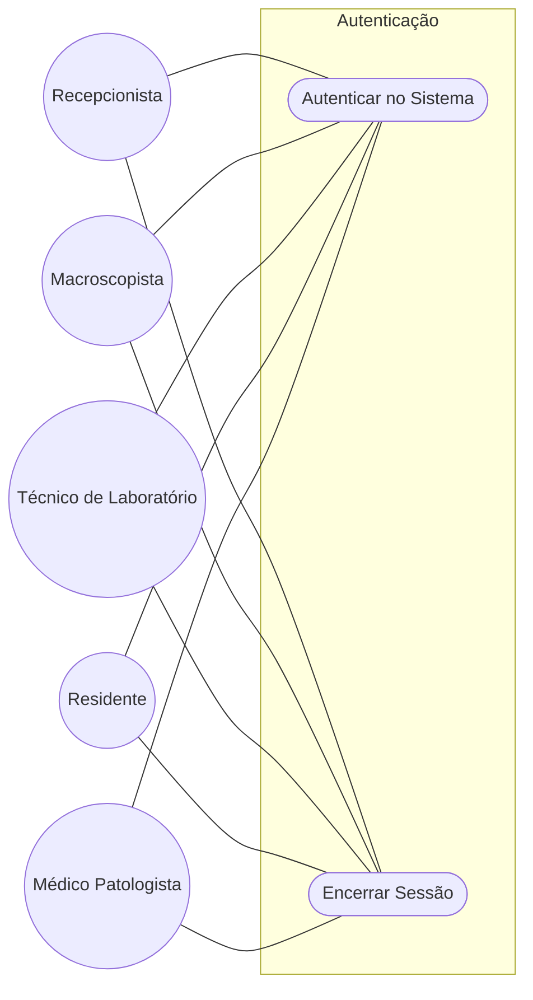
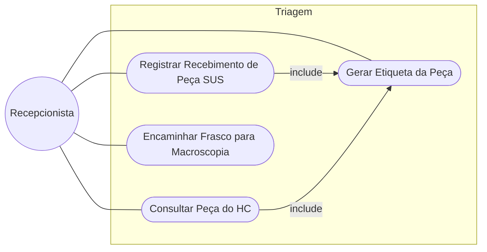
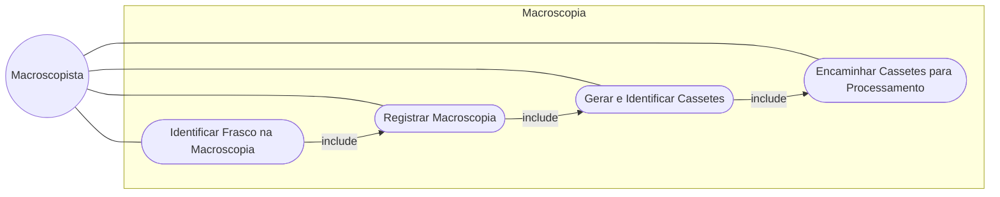
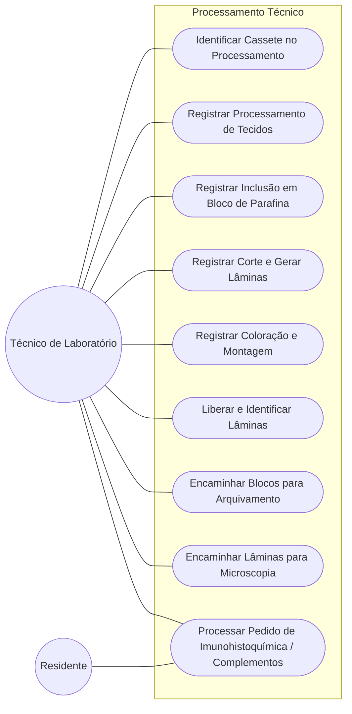
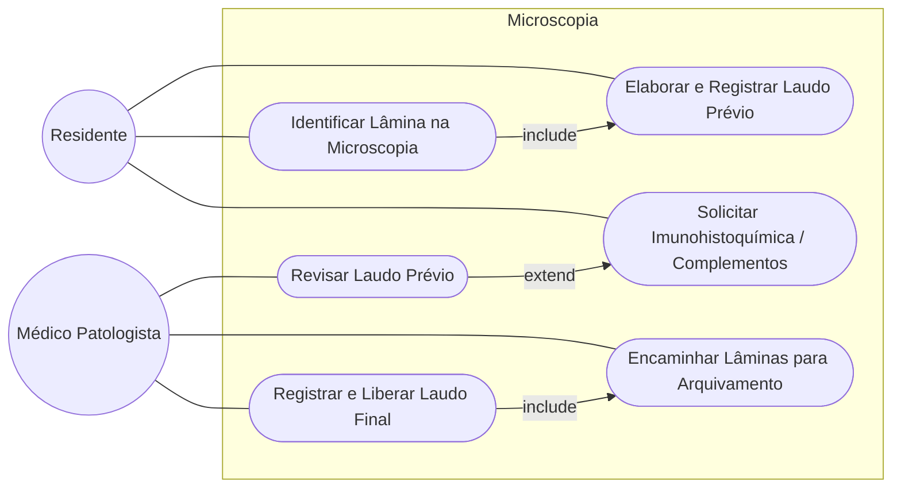
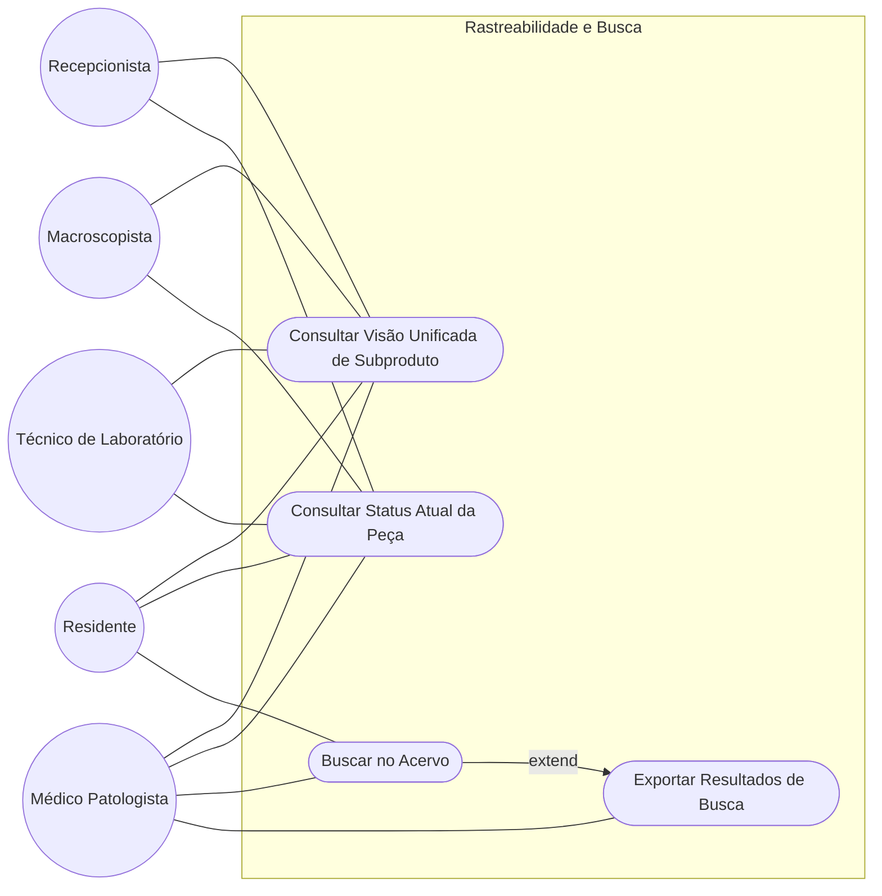

# Modelagem de Casos de Uso

## 1. Diagramas de Casos de Uso

### 1.1 Autenticação e Acesso

---

### 1.2 Triagem / Recepção

---

### 1.3 Macroscopia

---

### 1.4 Processamento Técnico

---

### 1.5 Microscopia

---

### 1.6 Rastreabilidade e Busca

---

## 2. Especificação dos Casos de Uso

---

### UC001 — Autenticar no Sistema

- **Atores**: Recepcionista, Macroscopista, Técnico de Laboratório, Residente, Médico Patologista.
- **Pré-condição**: Usuário cadastrado no LDAP/AD do hospital.
- **Fluxo principal**: Acessar o sistema → Inserir credenciais → Sistema valida via LDAP/AD → Redirecionar para interface do perfil correspondente.
- **Fluxo alternativo**: Credenciais inválidas → Exibir mensagem de erro → Permitir nova tentativa.
- **Pós-condição**: Sessão autenticada com token JWT ativo.
- **RFs relacionados**: RF001, RF002, RF004.

#### [CARE-UC001] Autenticação LDAP/AD

- **Context**: Servidor LDAP/AD configurado e acessível pela rede do hospital. Perfis de acesso mapeados por grupo do AD.
- **Action**: Implementar middleware de autenticação que consulte o AD, gere token JWT com o perfil do usuário embutido no payload e aplique controle de acesso por rota baseado no perfil.
- **Result**: Usuário autenticado recebe JWT; acesso restrito às funcionalidades do seu perfil; código 401 em falha de credenciais; código 403 em acesso a recurso fora do perfil.
- **Evaluation**: Validar manualmente os cinco perfis em ambiente de homologação, garantindo que cada um acessa apenas suas rotas permitidas.

---

### UC002 — Encerrar Sessão

- **Atores**: Recepcionista, Macroscopista, Técnico de Laboratório, Residente, Médico Patologista.
- **Pré-condição**: Usuário autenticado.
- **Fluxo principal**: Acionar logout → Sistema invalida o token → Redirecionar para tela de login.
- **Pós-condição**: Sessão encerrada; token inválido.
- **RFs relacionados**: RF003.

#### [CARE-UC002] Logout e Invalidação de Sessão

- **Context**: Usuário possui sessão ativa com JWT válido.
- **Action**: Implementar endpoint de logout que adicione o token a uma blocklist até sua expiração natural e limpe o estado de sessão no cliente.
- **Result**: Token rejeitado em qualquer requisição subsequente; usuário redirecionado para login.
- **Evaluation**: Validar manualmente que requisições com token pós-logout retornam 401.

---

### UC003 — Registrar Recebimento de Peça SUS

- **Ator**: Recepcionista.
- **Pré-condição**: Recepcionista autenticada. Peça identificada como proveniente do SUS.
- **Fluxo principal**: Selecionar origem SUS → Buscar paciente por CNS/CPF → Caso inexistente, cadastrar paciente → Registrar exame no AGHU → Sistema gera número de solicitação → `include` UC005 → Registrar data, hora e responsável pelo recebimento.
- **Fluxo alternativo**: Paciente já cadastrado no AGHU → Recuperar dados existentes e prosseguir sem novo cadastro.
- **Pós-condição**: Peça registrada com número de solicitação único; etiqueta impressa; status "Na Triagem".
- **RFs relacionados**: RF005, RF006, RF007, RF009, RF011.

#### [CARE-UC003] Registro de Peça SUS

- **Context**: Integração com AGHU ativa. Schema de paciente e exame criados no banco.
- **Action**: Implementar fluxo de verificação de existência do paciente por CNS/CPF antes de criar novo registro; registrar exame vinculado; gerar número de solicitação único; persistir recebimento com timestamp e usuário autenticado.
- **Result**: Paciente e exame persistidos ou recuperados do AGHU; número de solicitação gerado; log de recebimento criado.
- **Evaluation**: Validar manualmente o fluxo com paciente novo e com paciente já existente em ambiente de homologação.

---

### UC004 — Consultar Peça do HC

- **Ator**: Recepcionista.
- **Pré-condição**: Recepcionista autenticada. Peça identificada como proveniente do HC.
- **Fluxo principal**: Selecionar origem HC → Escanear código de barras da peça via pistola **ou** buscar manualmente por número de solicitação, CNS ou CPF → Sistema recupera dados do paciente e exame do AGHU → `include` UC005.
- **Fluxo alternativo**: Código/dado não encontrado no AGHU → Exibir mensagem de erro → Permitir nova tentativa ou cadastro manual.
- **Pós-condição**: Dados da peça recuperados do AGHU; etiqueta do sistema impressa; status "Na Triagem".
- **RFs relacionados**: RF005, RF008, RF009, RF011.

#### [CARE-UC004] Consulta de Peça HC

- **Context**: Leitor HID conectado à estação da triagem. Integração com AGHU ativa.
- **Action**: Implementar leitura de input HID do leitor de código de barras como campo de texto e consulta ao AGHU pelo identificador capturado; oferecer campo de busca manual como alternativa com os mesmos critérios de consulta.
- **Result**: Dados do paciente e exame exibidos; fluxo segue para geração de etiqueta.
- **Evaluation**: Validar manualmente os dois caminhos (escaneamento e busca manual) em ambiente de homologação.

---

### UC005 — Gerar Etiqueta da Peça

- **Ator**: Recepcionista.
- **Pré-condição**: Número de solicitação gerado (UC003 ou UC004 concluídos).
- **Fluxo principal**: Sistema gera QR Code vinculado ao número de solicitação → Envia comando de impressão para impressora térmica configurada na estação → Etiqueta impressa.
- **Fluxo alternativo**: Impressora indisponível → Exibir alerta e permitir reimpressão manual após resolução.
- **Pós-condição**: Etiqueta com QR Code impressa e colada no frasco.
- **RFs relacionados**: RF010, RF058, RF059.

#### [CARE-UC005] Geração e Impressão de Etiqueta da Peça

- **Context**: Impressora térmica Zebra/Argox configurada para a estação de triagem. Número de solicitação disponível.
- **Action**: Implementar geração de QR Code a partir do identificador único da peça; montar comando ZPL/EPL para impressora térmica; enviar para a impressora associada à estação.
- **Result**: Etiqueta impressa com QR Code legível e número de solicitação visível.
- **Evaluation**: Validar manualmente a leitura do QR Code impresso com pistola HID e com câmera de dispositivo móvel em ambiente de homologação.

---

### UC006 — Encaminhar Frasco para Macroscopia

- **Ator**: Recepcionista.
- **Pré-condição**: Peça registrada com etiqueta impressa.
- **Fluxo principal**: Confirmar encaminhamento do frasco → Sistema atualiza status para "Aguardando Macroscopia" → Registra responsável e timestamp da transição.
- **Pós-condição**: Peça visível na fila de macroscopia; histórico de movimentação atualizado.
- **RFs relacionados**: RF012, RF044.

#### [CARE-UC006] Transição de Status para Macroscopia

- **Context**: Peça com status "Na Triagem". Usuário autenticado como Recepcionista.
- **Action**: Implementar endpoint de transição de status com validação do estado atual antes de permitir a mudança; persistir responsável e timestamp; atualizar fila de macroscopia.
- **Result**: Status atualizado para "Aguardando Macroscopia"; entrada no histórico de movimentação criada.
- **Evaluation**: Validar manualmente a transição e a exibição na fila de macroscopia em ambiente de homologação.

---

### UC007 — Identificar Frasco na Macroscopia

- **Ator**: Macroscopista.
- **Pré-condição**: Frasco com status "Aguardando Macroscopia". Macroscopista autenticado.
- **Fluxo principal**: Escanear QR Code do frasco **ou** buscar manualmente pelo número de solicitação → Sistema exibe visão unificada com dados do paciente, exame e histórico importados do AGHU.
- **Fluxo alternativo**: QR Code ilegível → Utilizar busca manual por número de solicitação.
- **Pós-condição**: Dados da peça exibidos; frasco vinculado à sessão de trabalho do macroscopista.
- **RFs relacionados**: RF013, RF045, RF055, RF056.

#### [CARE-UC007] Identificação do Frasco na Macroscopia

- **Context**: Integração com AGHU ativa. Frasco com status "Aguardando Macroscopia".
- **Action**: Implementar leitura de QR Code via input HID e campo de busca manual; ao identificar a peça, buscar dados complementares no AGHU em tempo real e montar a visão unificada.
- **Result**: Tela unificada exibida com dados locais e do AGHU consolidados.
- **Evaluation**: Validar manualmente os dois caminhos de identificação e a exibição correta dos dados do AGHU em ambiente de homologação.

---

### UC008 — Registrar Macroscopia

- **Ator**: Macroscopista.
- **Pré-condição**: Frasco identificado (UC007 concluído).
- **Fluxo principal**: Preencher descrição da macroscopia → Informar número de cassetes → Confirmar data e responsável → Sistema persiste o registro → Sincroniza com AGHU.
- **Pós-condição**: Macroscopia registrada no sistema e no AGHU; fluxo segue para geração de cassetes.
- **RFs relacionados**: RF014, RF018, RF057.

#### [CARE-UC008] Registro e Sincronização da Macroscopia

- **Context**: Frasco identificado na sessão. Integração com AGHU ativa.
- **Action**: Implementar formulário de registro da macroscopia com persistência local e envio dos dados (descrição, data, número de cassetes, responsável) ao AGHU via integração.
- **Result**: Dados persistidos localmente e registrados no AGHU; status da peça atualizado.
- **Evaluation**: Validar manualmente o registro e confirmar a presença dos dados no AGHU em ambiente de homologação.

---

### UC009 — Gerar e Identificar Cassetes

- **Ator**: Macroscopista.
- **Pré-condição**: Macroscopia registrada (UC008 concluído).
- **Fluxo principal**: Informar quantidade de cassetes → Sistema gera identificadores únicos vinculados à peça → Gera e imprime etiquetas com QR Code para cada cassete → Macroscopista confirma a identidade de cada cassete por escaneamento **ou** por seleção manual na lista gerada.
- **Fluxo alternativo**: Impressora indisponível → Exibir alerta e permitir reimpressão após resolução.
- **Pós-condição**: Cassetes gerados, identificados e vinculados hierarquicamente à peça matriz.
- **RFs relacionados**: RF015, RF016, RF017.

#### [CARE-UC009] Geração e Identificação de Cassetes

- **Context**: Peça com macroscopia registrada. Impressora térmica configurada para a estação.
- **Action**: Implementar criação de N registros de cassete vinculados à peça com identificadores únicos; gerar e imprimir etiqueta QR Code para cada um; implementar confirmação por leitura HID ou seleção manual na listagem.
- **Result**: Cassetes persistidos com vínculo hierárquico à peça; etiquetas impressas; cada cassete confirmado.
- **Evaluation**: Validar manualmente os dois caminhos de confirmação (escaneamento e seleção manual) em ambiente de homologação.

---

### UC010 — Encaminhar Cassetes para Processamento

- **Ator**: Macroscopista.
- **Pré-condição**: Todos os cassetes gerados e identificados (UC009 concluído).
- **Fluxo principal**: Confirmar encaminhamento → Sistema atualiza status de cada cassete para "Aguardando Processamento" → Registra responsável e timestamp.
- **Pós-condição**: Cassetes visíveis na fila de processamento técnico; histórico atualizado.
- **RFs relacionados**: RF019, RF044.

#### [CARE-UC010] Transição de Cassetes para Processamento

- **Context**: Cassetes com status "Identificado". Usuário autenticado como Macroscopista.
- **Action**: Implementar transição de status em lote para todos os cassetes do lote; persistir responsável e timestamp; atualizar fila de processamento.
- **Result**: Cassetes com status "Aguardando Processamento"; histórico atualizado.
- **Evaluation**: Validar manualmente a transição em lote e a exibição na fila de processamento em ambiente de homologação.

---

### UC011 — Identificar Cassete no Processamento

- **Ator**: Técnico de Laboratório.
- **Pré-condição**: Cassete com status "Aguardando Processamento". Técnico autenticado.
- **Fluxo principal**: Escanear QR Code do cassete **ou** buscar manualmente pelo identificador → Sistema exibe dados do cassete, peça de origem e paciente.
- **Fluxo alternativo**: QR Code ilegível → Utilizar busca manual pelo identificador do cassete.
- **Pós-condição**: Cassete vinculado à sessão de trabalho do técnico.
- **RFs relacionados**: RF020, RF045.

#### [CARE-UC011] Identificação do Cassete no Processamento

- **Context**: Cassete com status "Aguardando Processamento".
- **Action**: Implementar leitura por QR Code via input HID e campo de busca manual; exibir dados do cassete, peça de origem e paciente ao identificar.
- **Result**: Dados do cassete e hierarquia exibidos; técnico e cassete vinculados para as etapas seguintes.
- **Evaluation**: Validar manualmente os dois caminhos de identificação em ambiente de homologação.

---

### UC012 — Registrar Processamento de Tecidos

- **Ator**: Técnico de Laboratório.
- **Pré-condição**: Cassete identificado (UC011 concluído).
- **Fluxo principal**: Confirmar início do processamento → Sistema registra data de início, técnico responsável e cassetes em processamento → Atualiza status para "Em Processamento".
- **Pós-condição**: Processamento registrado; histórico atualizado.
- **RFs relacionados**: RF021.

#### [CARE-UC012] Registro do Processamento de Tecidos

- **Context**: Cassete com status "Aguardando Processamento". Técnico autenticado.
- **Action**: Implementar registro da etapa com persistência de data de início, técnico responsável e vínculo ao cassete; atualizar status.
- **Result**: Etapa persistida; status do cassete atualizado para "Em Processamento".
- **Evaluation**: Validar manualmente o registro e a atualização de status em ambiente de homologação.

---

### UC013 — Registrar Inclusão em Bloco de Parafina

- **Ator**: Técnico de Laboratório.
- **Pré-condição**: Processamento de tecidos registrado (UC012 concluído).
- **Fluxo principal**: Informar quantidade de blocos gerados → Sistema cria registros de blocos vinculados ao cassete → Gera e imprime etiquetas com QR Code para cada bloco → Técnico confirma identidade de cada bloco por escaneamento **ou** por seleção manual.
- **Pós-condição**: Blocos de parafina gerados, identificados e vinculados hierarquicamente ao cassete.
- **RFs relacionados**: RF022, RF023.

#### [CARE-UC013] Geração e Identificação de Blocos de Parafina

- **Context**: Cassete em processamento. Impressora térmica configurada para a estação.
- **Action**: Implementar criação de N blocos vinculados ao cassete com identificadores únicos; gerar e imprimir etiquetas; confirmação por leitura HID ou seleção manual.
- **Result**: Blocos persistidos com vínculo hierárquico ao cassete; etiquetas impressas.
- **Evaluation**: Validar manualmente os dois caminhos de confirmação em ambiente de homologação.

---

### UC014 — Registrar Corte e Gerar Lâminas

- **Ator**: Técnico de Laboratório.
- **Pré-condição**: Blocos de parafina identificados (UC013 concluído).
- **Fluxo principal**: Registrar etapa de corte → Informar quantidade de lâminas por bloco → Sistema cria registros de lâminas vinculados ao bloco → Gera e imprime etiquetas com QR Code para cada lâmina.
- **Pós-condição**: Corte registrado; lâminas geradas e vinculadas hierarquicamente ao bloco.
- **RFs relacionados**: RF024, RF025, RF028.

#### [CARE-UC014] Registro de Corte e Geração de Lâminas

- **Context**: Bloco de parafina identificado. Impressora térmica configurada para a estação.
- **Action**: Implementar registro da etapa de corte; criar N lâminas vinculadas ao bloco com identificadores únicos; gerar e imprimir etiquetas QR Code para cada lâmina.
- **Result**: Etapa de corte persistida; lâminas geradas com hierarquia correta; etiquetas impressas.
- **Evaluation**: Validar manualmente a hierarquia peça → cassete → bloco → lâmina no sistema em ambiente de homologação.

---

### UC015 — Registrar Coloração e Montagem

- **Ator**: Técnico de Laboratório.
- **Pré-condição**: Lâminas geradas (UC014 concluído).
- **Fluxo principal**: Registrar etapa de coloração e montagem → Informar técnico responsável e data → Sistema persiste o registro e atualiza status das lâminas.
- **Pós-condição**: Coloração e montagem registradas; lâminas com status atualizado.
- **RFs relacionados**: RF026.

#### [CARE-UC015] Registro de Coloração e Montagem

- **Context**: Lâminas geradas e vinculadas ao bloco.
- **Action**: Implementar registro da etapa com data, técnico responsável e vínculo às lâminas do lote.
- **Result**: Etapa persistida; status das lâminas atualizado.
- **Evaluation**: Validar manualmente o registro em ambiente de homologação.

---

### UC016 — Liberar e Identificar Lâminas

- **Ator**: Técnico de Laboratório.
- **Pré-condição**: Coloração e montagem registradas (UC015 concluído).
- **Fluxo principal**: Registrar liberação das lâminas com data, número de lâminas e técnico responsável → Técnico confirma identidade de cada lâmina por escaneamento **ou** por seleção manual → Sistema atualiza status para "Lâminas Liberadas".
- **Pós-condição**: Lâminas liberadas e identificadas; prontas para envio à Microscopia.
- **RFs relacionados**: RF027, RF029.

#### [CARE-UC016] Liberação e Identificação de Lâminas

- **Context**: Lâminas com coloração e montagem registradas.
- **Action**: Implementar registro de liberação com persistência de data, número de lâminas e responsável; confirmação por leitura HID ou seleção manual na listagem.
- **Result**: Lâminas com status "Lâminas Liberadas"; registro de liberação persistido.
- **Evaluation**: Validar manualmente os dois caminhos de confirmação em ambiente de homologação.

---

### UC017 — Encaminhar Blocos para Arquivamento

- **Ator**: Técnico de Laboratório.
- **Pré-condição**: Lâminas liberadas. Blocos de parafina identificados.
- **Fluxo principal**: Confirmar identidade dos blocos por escaneamento **ou** seleção manual → Confirmar encaminhamento para arquivo físico → Sistema atualiza status dos blocos para "Arquivado" → Registra responsável e timestamp.
- **Pós-condição**: Blocos com status "Arquivado"; histórico atualizado.
- **RFs relacionados**: RF030, RF032, RF044.

#### [CARE-UC017] Arquivamento de Blocos de Parafina

- **Context**: Blocos identificados. Técnico autenticado.
- **Action**: Implementar confirmação de identidade por leitura HID ou seleção manual; transição de status para "Arquivado" com registro de responsável e timestamp.
- **Result**: Blocos arquivados no sistema; histórico atualizado.
- **Evaluation**: Validar manualmente os dois caminhos de confirmação e a atualização de status em ambiente de homologação.

---

### UC018 — Encaminhar Lâminas para Microscopia

- **Ator**: Técnico de Laboratório.
- **Pré-condição**: Lâminas liberadas e identificadas (UC016 concluído).
- **Fluxo principal**: Confirmar encaminhamento → Sistema atualiza status das lâminas para "Aguardando Microscopia" → Registra responsável e timestamp.
- **Pós-condição**: Lâminas visíveis na fila de microscopia; histórico atualizado.
- **RFs relacionados**: RF031, RF044.

#### [CARE-UC018] Transição de Lâminas para Microscopia

- **Context**: Lâminas com status "Lâminas Liberadas". Técnico autenticado.
- **Action**: Implementar transição de status em lote para as lâminas do conjunto; persistir responsável e timestamp; atualizar fila de microscopia.
- **Result**: Lâminas com status "Aguardando Microscopia"; histórico atualizado.
- **Evaluation**: Validar manualmente a transição e a exibição na fila de microscopia em ambiente de homologação.

---

### UC019 — Processar Pedido de Imunohistoquímica / Complementos

- **Atores**: Técnico de Laboratório, Residente.
- **Pré-condição**: Pedido de imunohistoquímica/complementos registrado na Microscopia (UC023 concluído).
- **Fluxo principal**: Sistema exibe pedido na fila do processamento → Técnico identifica o bloco de parafina correspondente por escaneamento **ou** busca manual → Reintroduz o bloco no fluxo a partir da etapa de corte (UC014).
- **Pós-condição**: Bloco reintroduzido no fluxo; pedido vinculado ao exame de origem.
- **RFs relacionados**: RF033.

#### [CARE-UC019] Reintrodução de Bloco por Pedido de Complemento

- **Context**: Pedido de imunohistoquímica/complementos registrado e vinculado ao exame. Bloco de parafina arquivado ou disponível.
- **Action**: Implementar fila de pedidos de complemento visível no processamento; ao aceitar o pedido, reativar o bloco correspondente e permitir retomada do fluxo a partir do corte, mantendo vínculo com o exame original.
- **Result**: Bloco reativado no fluxo; pedido marcado como "Em Processamento".
- **Evaluation**: Validar manualmente o fluxo completo de solicitação na Microscopia e reprocessamento no Processamento Técnico em ambiente de homologação.

---

### UC020 — Identificar Lâmina na Microscopia

- **Ator**: Residente.
- **Pré-condição**: Lâmina com status "Aguardando Microscopia". Residente autenticado.
- **Fluxo principal**: Escanear QR Code da lâmina **ou** buscar manualmente pelo identificador → Sistema exibe visão unificada com dados do paciente, exame, histórico de processamento e dados do AGHU.
- **Fluxo alternativo**: QR Code ilegível → Utilizar busca manual pelo identificador da lâmina.
- **Pós-condição**: Dados da lâmina exibidos; lâmina vinculada à sessão de trabalho do residente.
- **RFs relacionados**: RF034, RF045, RF055, RF056.

#### [CARE-UC020] Identificação da Lâmina na Microscopia

- **Context**: Integração com AGHU ativa. Lâmina com status "Aguardando Microscopia".
- **Action**: Implementar leitura por QR Code via input HID e campo de busca manual; ao identificar, consolidar dados locais com dados do AGHU em tempo real e exibir visão unificada.
- **Result**: Visão unificada exibida com histórico completo e dados clínicos do AGHU.
- **Evaluation**: Validar manualmente os dois caminhos de identificação e a exibição correta dos dados em ambiente de homologação.

---

### UC021 — Elaborar e Registrar Laudo Prévio

- **Ator**: Residente.
- **Pré-condição**: Lâmina identificada (UC020 concluído).
- **Fluxo principal**: Preencher laudo prévio → Confirmar registro → Sistema persiste localmente → Sincroniza laudo prévio com AGHU → Atualiza status para "Laudo Prévio Registrado".
- **Pós-condição**: Laudo prévio disponível para revisão do médico patologista.
- **RFs relacionados**: RF035, RF036, RF057.

#### [CARE-UC021] Registro e Sincronização do Laudo Prévio

- **Context**: Lâmina identificada. Integração com AGHU ativa.
- **Action**: Implementar formulário de laudo prévio com persistência local e sincronização com AGHU; atualizar status da lâmina/exame após confirmação.
- **Result**: Laudo prévio persistido localmente e enviado ao AGHU; exame visível na fila de revisão do patologista.
- **Evaluation**: Validar manualmente o registro e confirmar presença do laudo no AGHU em ambiente de homologação.

---

### UC022 — Revisar Laudo Prévio

- **Ator**: Médico Patologista.
- **Pré-condição**: Laudo prévio registrado (UC021 concluído). Médico autenticado.
- **Fluxo principal**: Selecionar laudo prévio na fila de revisão → Analisar laudo e lâmina → Aprovar laudo → Segue para UC024.
- **Fluxo alternativo (extend UC023)**: Reprovar laudo por necessidade de complemento → Residente solicita imunohistoquímica/complementos (UC023).
- **Pós-condição**: Laudo aprovado segue para registro final; laudo reprovado gera pedido de complemento.
- **RFs relacionados**: RF037.

#### [CARE-UC022] Revisão de Laudo pelo Patologista

- **Context**: Laudos prévios com status "Aguardando Revisão" visíveis na fila do patologista.
- **Action**: Implementar fila de revisão filtrada por perfil de Médico Patologista; ações de aprovação e reprovação com registro da decisão e responsável.
- **Result**: Laudo aprovado avança para registro final; laudo reprovado dispara fluxo de solicitação de complemento.
- **Evaluation**: Validar manualmente os dois desfechos (aprovação e reprovação) em ambiente de homologação.

---

### UC023 — Solicitar Imunohistoquímica / Complementos

- **Ator**: Residente.
- **Pré-condição**: Laudo reprovado pelo patologista por necessidade de complemento (UC022 — fluxo alternativo).
- **Fluxo principal**: Residente preenche solicitação de imunohistoquímica/complementos → Informa tipo de complemento solicitado → Sistema registra data, solicitante e exame vinculado → Gera pedido na fila do Processamento Técnico (UC019).
- **Pós-condição**: Pedido registrado e visível na fila do Processamento Técnico.
- **RFs relacionados**: RF038, RF039.

#### [CARE-UC023] Registro de Solicitação de Complemento

- **Context**: Laudo com status "Reprovado — Necessita Complemento". Residente autenticado.
- **Action**: Implementar formulário de solicitação com persistência de tipo de complemento, data, solicitante e vínculo ao exame; criar entrada na fila de processamento visível ao Técnico de Laboratório.
- **Result**: Solicitação persistida; pedido visível na fila do processamento; status do exame atualizado para "Aguardando Complemento".
- **Evaluation**: Validar manualmente a criação do pedido e sua visibilidade no processamento em ambiente de homologação.

---

### UC024 — Registrar e Liberar Laudo Final

- **Ator**: Médico Patologista.
- **Pré-condição**: Laudo prévio aprovado (UC022 concluído).
- **Fluxo principal**: Médico registra laudo final → Confirma liberação → Sistema sincroniza laudo final com AGHU → Aciona marcação automática do exame como liberado → `include` UC025.
- **Pós-condição**: Laudo final registrado no AGHU; exame marcado como "Liberado" automaticamente.
- **RFs relacionados**: RF040, RF041, RF042, RF057.

#### [CARE-UC024] Registro de Laudo Final e Liberação Automática

- **Context**: Laudo prévio aprovado. Integração com AGHU ativa.
- **Action**: Implementar registro do laudo final com sincronização ao AGHU; após confirmação de envio bem-sucedido, acionar automaticamente a marcação do exame como liberado no sistema local sem interação adicional do usuário.
- **Result**: Laudo final no AGHU; exame com status "Liberado" no sistema; histórico atualizado.
- **Evaluation**: Validar manualmente o fluxo completo de registro, sincronização e marcação automática em ambiente de homologação.

---

### UC025 — Encaminhar Lâminas para Arquivamento

- **Ator**: Médico Patologista.
- **Pré-condição**: Laudo final liberado (UC024 concluído).
- **Fluxo principal**: Sistema sinaliza lâminas para arquivamento → Médico confirma encaminhamento → Status das lâminas atualizado para "Arquivada" → Registra responsável e timestamp.
- **Pós-condição**: Lâminas arquivadas; histórico atualizado.
- **RFs relacionados**: RF043, RF044.

#### [CARE-UC025] Arquivamento de Lâminas Pós-Laudo

- **Context**: Lâminas com laudo liberado. Médico Patologista autenticado.
- **Action**: Implementar transição de status das lâminas do exame para "Arquivada" com registro de responsável e timestamp.
- **Result**: Lâminas com status "Arquivada"; histórico atualizado.
- **Evaluation**: Validar manualmente a atualização de status e o registro no histórico em ambiente de homologação.

---

### UC026 — Consultar Visão Unificada de Subproduto

- **Atores**: Recepcionista, Macroscopista, Técnico de Laboratório, Residente, Médico Patologista.
- **Pré-condição**: Usuário autenticado.
- **Fluxo principal**: Escanear QR Code de qualquer subproduto (frasco, cassete, bloco ou lâmina) **ou** buscar manualmente pelo identificador ou número de solicitação → Sistema exibe visão unificada com hierarquia completa da peça, histórico de movimentação com timestamps e dados clínicos importados do AGHU em tempo real.
- **Pós-condição**: Visão unificada exibida.
- **RFs relacionados**: RF045, RF055, RF056.

#### [CARE-UC026] Visão Unificada de Subproduto

- **Context**: Integração com AGHU ativa. Qualquer subproduto registrado no sistema.
- **Action**: Implementar endpoint de consulta que, dado um identificador de subproduto, retorne a hierarquia completa (peça → cassetes → blocos → lâminas), o histórico de movimentação com responsáveis e timestamps, e os dados clínicos do AGHU consultados em tempo real; resposta em no máximo 2 segundos.
- **Result**: Tela unificada exibida com todos os dados consolidados.
- **Evaluation**: Validar manualmente os dois caminhos de acesso (escaneamento e busca manual) e a completude dos dados exibidos em ambiente de homologação.

---

### UC027 — Consultar Status Atual da Peça

- **Atores**: Recepcionista, Macroscopista, Técnico de Laboratório, Residente, Médico Patologista.
- **Pré-condição**: Usuário autenticado.
- **Fluxo principal**: Escanear QR Code **ou** buscar por número de solicitação, identificador, CNS ou CPF → Sistema retorna em qual etapa do fluxo a peça ou subproduto se encontra atualmente, com responsável e timestamp da última transição.
- **Pós-condição**: Status atual exibido com contexto da última movimentação.
- **RFs relacionados**: RF046, RF047.

#### [CARE-UC027] Consulta de Status da Peça

- **Context**: Peça registrada no sistema com ao menos uma transição de status.
- **Action**: Implementar consulta de status que retorne a etapa atual, responsável e timestamp da última transição; implementar verificação de prazo e sinalização de alerta quando o tempo na etapa atual exceder o limite configurado.
- **Result**: Status atual exibido; alertas de prazo sinalizados quando aplicável.
- **Evaluation**: Validar manualmente a consulta por todos os critérios de busca e o disparo de alerta de prazo em ambiente de homologação.

---

### UC028 — Buscar no Acervo

- **Atores**: Residente, Médico Patologista.
- **Pré-condição**: Usuário autenticado com perfil de Residente ou Médico Patologista.
- **Fluxo principal**: Acessar módulo de busca → Aplicar um ou mais filtros disponíveis (número de solicitação, dados do paciente, período, tipo de peça, diagnóstico, marcadores/complementos) → Sistema retorna lista de exames correspondentes.
- **Fluxo alternativo (extend UC029)**: Exportar resultados da busca para uso em pesquisa.
- **Pós-condição**: Lista de exames exibida conforme filtros aplicados.
- **RFs relacionados**: RF048, RF049, RF050, RF051, RF052, RF053.

#### [CARE-UC028] Busca no Acervo

- **Context**: Exames registrados no sistema. Usuário com perfil de Residente ou Médico Patologista autenticado.
- **Action**: Implementar endpoint de busca com suporte a múltiplos filtros combinados; retornar resultados paginados em no máximo 3 segundos para filtros simples.
- **Result**: Lista de exames retornada conforme critérios; paginação aplicada.
- **Evaluation**: Validar manualmente cada filtro individualmente e em combinação em ambiente de homologação.

---

### UC029 — Exportar Resultados de Busca

- **Ator**: Médico Patologista.
- **Pré-condição**: Busca realizada com resultados disponíveis (UC028 concluído).
- **Fluxo principal**: Solicitar exportação dos resultados → Sistema gera arquivo exportável com os dados da listagem atual.
- **Pós-condição**: Arquivo disponibilizado para download.
- **RFs relacionados**: RF054.

#### [CARE-UC029] Exportação de Resultados

- **Context**: Resultados de busca disponíveis na sessão. Usuário com perfil de Médico Patologista.
- **Action**: Implementar geração de arquivo exportável (formato a definir) com os dados da listagem atual de busca, respeitando os filtros aplicados.
- **Result**: Arquivo gerado e disponibilizado para download.
- **Evaluation**: Validar manualmente a geração e integridade dos dados exportados em ambiente de homologação.