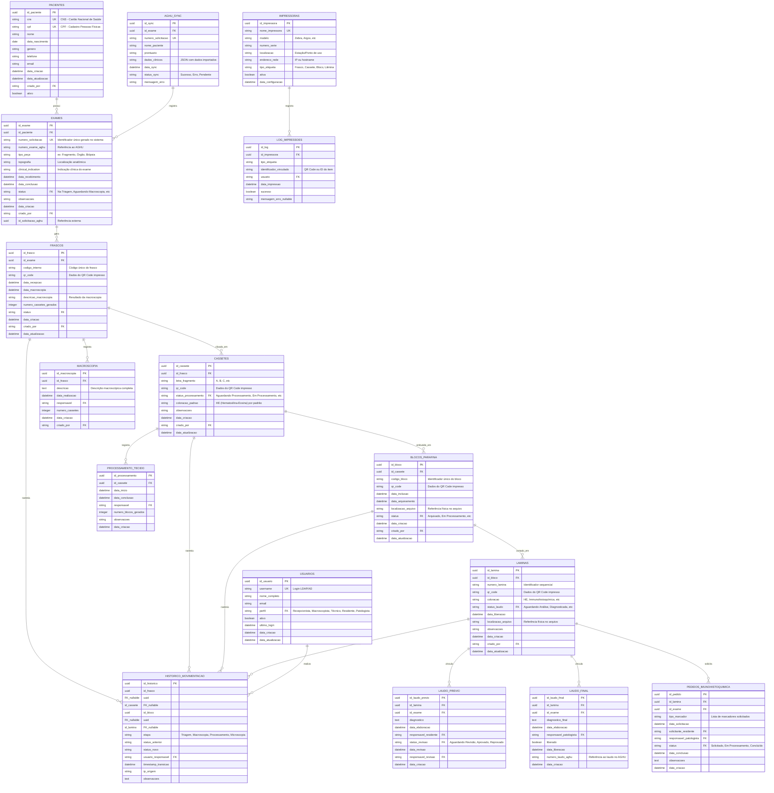

# Modelo de Dados e Dicionário

## 1. Modelo Entidade-Relacionamento

A estrutura foca na árvore hierárquica das amostras físicas, mantendo apenas o identificador da solicitação do AGHU para relacionamentos externos e garantindo rastreabilidade completa através do histórico de movimentação.



## 2. Dicionário de Dados

### Tabelas Principais

#### Tabela: PACIENTES
Armazena dados demográficos do paciente. CNS é a chave primária preferencial (SUS), CPF é alternativa.

| Campo | Tipo | Constraints | Descrição |
|---|---|---|---|
| id_paciente | UUID | PK | Identificador único do paciente no sistema |
| cns | VARCHAR(15) | UNIQUE, NULLABLE | Cartão Nacional de Saúde (SUS) |
| cpf | VARCHAR(11) | UNIQUE | Cadastro de Pessoa Física (11 dígitos) |
| nome | VARCHAR(200) | NOT NULL | Nome completo do paciente |
| data_nascimento | DATE | NOT NULL | Data de nascimento (formato YYYY-MM-DD) |
| genero | CHAR(1) | CHECK IN ('M', 'F', 'O') | Gênero do paciente |
| telefone | VARCHAR(20) | NULLABLE | Telefone de contato |
| email | VARCHAR(100) | NULLABLE | E-mail do paciente |
| data_criacao | TIMESTAMP | DEFAULT CURRENT_TIMESTAMP | Data de criação do registro |
| data_atualizacao | TIMESTAMP | DEFAULT CURRENT_TIMESTAMP | Última atualização |
| criado_por | UUID | FK (USUARIOS) | Usuário que criou o registro |
| ativo | BOOLEAN | DEFAULT TRUE | Indica se o paciente está ativo |

**Regras de Integridade:**
- CNS ou CPF obrigatório (pelo menos um deve estar preenchido).
- CPF deve passar em validação de dígito verificador.
- CNS deve ter formato válido (15 dígitos).
- Data de nascimento não pode ser futura.

---

#### Tabela: EXAMES
Armazena informações da solicitação de exame patológico vinculada ao paciente.

| Campo | Tipo | Constraints | Descrição |
|---|---|---|---|
| id_exame | UUID | PK | Identificador único da solicitação no sistema |
| id_paciente | UUID | FK (PACIENTES), NOT NULL | Referência ao paciente |
| numero_solicitacao | VARCHAR(50) | UNIQUE, NOT NULL | Número único gerado na triagem (ex: PATH-2024-001001) |
| numero_exame_aghu | VARCHAR(50) | NULLABLE | Referência ao número do exame no AGHU |
| tipo_peça | VARCHAR(100) | NOT NULL | Tipo de peça (Fragmento, Órgão, Biópsia, etc) |
| topografia | VARCHAR(200) | NOT NULL | Localização anatômica (ex: Mama, Cólon) |
| clinical_indication | TEXT | NOT NULL | Indicação clínica do exame |
| data_recebimento | TIMESTAMP | NOT NULL | Data/hora de recebimento na triagem |
| data_conclusao | TIMESTAMP | NULLABLE | Data/hora de conclusão (laudo liberado) |
| status | VARCHAR(50) | FK (STATUS_ENUM), NOT NULL | Status atual do exame |
| observacoes | TEXT | NULLABLE | Observações gerais sobre o exame |
| data_criacao | TIMESTAMP | DEFAULT CURRENT_TIMESTAMP | Data de criação |
| criado_por | UUID | FK (USUARIOS), NOT NULL | Recepcionista que registrou |
| id_solicitacao_aghu | UUID | NULLABLE | Identificador único da solicitação no AGHU |

**Regras de Integridade:**
- Número de solicitação é gerado automaticamente e nunca pode ser duplicado.
- Status segue transições pré-definidas (diagrama de estados).
- Data de conclusão não pode ser anterior a data_recebimento.

---

#### Tabela: AGHU_SYNC
Registro de sincronização com o AGHU, armazenando dados importados e status de integração.

| Campo | Tipo | Constraints | Descrição |
|---|---|---|---|
| id_sync | UUID | PK | Identificador único do registro de sync |
| id_exame | UUID | FK (EXAMES), NOT NULL | Referência ao exame |
| numero_solicitacao | VARCHAR(50) | UNIQUE, NOT NULL | Número da solicitação (para rastreamento) |
| nome_paciente | VARCHAR(200) | NOT NULL | Nome do paciente no AGHU |
| prontuario | VARCHAR(50) | NOT NULL | Prontuário do paciente no AGHU |
| dados_clinicos | JSON | NOT NULL | Dados clínicos importados (estrutura flexível) |
| data_sync | TIMESTAMP | NOT NULL | Data/hora da última sincronização |
| status_sync | VARCHAR(20) | CHECK IN ('Sucesso', 'Erro', 'Pendente'), NOT NULL | Status da sincronização |
| mensagem_erro | TEXT | NULLABLE | Mensagem de erro se status = 'Erro' |

**Regras de Integridade:**
- Cada exame tem no máximo um registro AGHU_SYNC ativo.
- Retry automático em caso de falha de sincronização.

---

#### Tabela: FRASCOS
Armazena a peça bruta (frasco/recipiente) recebida na triagem, matriz para os cassetes.

| Campo | Tipo | Constraints | Descrição |
|---|---|---|---|
| id_frasco | UUID | PK | Identificador único do frasco |
| id_exame | UUID | FK (EXAMES), NOT NULL | Referência à solicitação de exame |
| codigo_interno | VARCHAR(50) | UNIQUE, NOT NULL | Código interno do frasco (gerado na triagem) |
| qr_code | VARCHAR(500) | UNIQUE, NOT NULL | Dados do QR Code impresso (pode conter múltiplas informações) |
| data_recepcao | TIMESTAMP | NOT NULL | Data/hora de recebimento do frasco |
| data_macroscopia | TIMESTAMP | NULLABLE | Data/hora de realização da macroscopia |
| descricao_macroscopia | TEXT | NULLABLE | Resultado da macroscopia (descrição completa) |
| numero_cassetes_gerados | INTEGER | DEFAULT 0 | Quantidade de cassetes clivados da peça |
| status | VARCHAR(50) | FK (STATUS_ENUM), NOT NULL | Status atual do frasco |
| data_criacao | TIMESTAMP | DEFAULT CURRENT_TIMESTAMP | Data de criação |
| criado_por | UUID | FK (USUARIOS), NOT NULL | Usuário que registrou |
| data_atualizacao | TIMESTAMP | DEFAULT CURRENT_TIMESTAMP | Última atualização |

**Regras de Integridade:**
- Código interno e QR Code são únicos globalmente.
- Número de cassetes não pode ser negativo.
- Status segue transições pré-definidas.

---

#### Tabela: CASSETES
Armazena os fragmentos clivados do frasco na macroscopia, cada um é uma unidade de processamento.

| Campo | Tipo | Constraints | Descrição |
|---|---|---|---|
| id_cassete | UUID | PK | Identificador único do cassete |
| id_frasco | UUID | FK (FRASCOS), NOT NULL | Referência ao frasco de origem |
| letra_fragmento | VARCHAR(5) | NOT NULL | Letra identificadora (A, B, C, ..., Z, AA, AB) |
| qr_code | VARCHAR(500) | UNIQUE, NOT NULL | Dados do QR Code impresso do cassete |
| status_processamento | VARCHAR(50) | FK (STATUS_ENUM), NOT NULL | Status do cassete (Aguardando Processamento, Em Processamento, etc) |
| coloracao_padrao | VARCHAR(50) | DEFAULT 'HE' | Coloração padrão (HE = Hematoxilina-Eosina) |
| observacoes | TEXT | NULLABLE | Observações específicas do cassete |
| data_criacao | TIMESTAMP | DEFAULT CURRENT_TIMESTAMP | Data de criação |
| criado_por | UUID | FK (USUARIOS), NOT NULL | Usuário que registrou (Macroscopista) |
| data_atualizacao | TIMESTAMP | DEFAULT CURRENT_TIMESTAMP | Última atualização |

**Regras de Integridade:**
- Combinação (id_frasco, letra_fragmento) é única.
- QR Code é único globalmente.
- Status segue transições pré-definidas.

---

#### Tabela: BLOCOS_PARAFINA
Armazena os blocos de parafina gerados durante o processamento técnico, cada bloco é matriz para as lâminas.

| Campo | Tipo | Constraints | Descrição |
|---|---|---|---|
| id_bloco | UUID | PK | Identificador único do bloco |
| id_cassete | UUID | FK (CASSETES), NOT NULL | Referência ao cassete de origem |
| codigo_bloco | VARCHAR(50) | UNIQUE, NOT NULL | Código único do bloco (ex: B001, B002) |
| qr_code | VARCHAR(500) | UNIQUE, NOT NULL | Dados do QR Code impresso do bloco |
| data_inclusao | TIMESTAMP | NOT NULL | Data/hora de inclusão em parafina |
| data_arquivamento | TIMESTAMP | NULLABLE | Data/hora de arquivamento no arquivo físico |
| localizacao_arquivo | VARCHAR(200) | NULLABLE | Referência física no arquivo (ex: Estante A, Gaveta 3, Posição 15) |
| status | VARCHAR(50) | FK (STATUS_ENUM), NOT NULL | Status do bloco (Em Processamento, Arquivado) |
| data_criacao | TIMESTAMP | DEFAULT CURRENT_TIMESTAMP | Data de criação |
| criado_por | UUID | FK (USUARIOS), NOT NULL | Usuário que registrou (Técnico) |
| data_atualizacao | TIMESTAMP | DEFAULT CURRENT_TIMESTAMP | Última atualização |

**Regras de Integridade:**
- Código do bloco é único globalmente.
- QR Code é único globalmente.
- Data de arquivamento não pode ser anterior a data_inclusao.
- Localização é obrigatória quando status = 'Arquivado'.

---

#### Tabela: LAMINAS
Armazena as lâminas cortadas do bloco de parafina, unidade final para diagnóstico.

| Campo | Tipo | Constraints | Descrição |
|---|---|---|---|
| id_lamina | UUID | PK | Identificador único da lâmina |
| id_bloco | UUID | FK (BLOCOS_PARAFINA), NOT NULL | Referência ao bloco de origem |
| numero_lamina | VARCHAR(50) | NOT NULL | Número sequencial da lâmina (ex: L001, L002) |
| qr_code | VARCHAR(500) | UNIQUE, NOT NULL | Dados do QR Code impresso da lâmina |
| coloracao | VARCHAR(100) | NOT NULL | Tipo de coloração (HE, Immunohistoquímica, Azul de Prússia, etc) |
| status_laudo | VARCHAR(50) | FK (STATUS_ENUM), NOT NULL | Status do laudo (Aguardando Análise, Diagnosticada, Arquivada) |
| data_liberacao | TIMESTAMP | NULLABLE | Data/hora de liberação (quando laudo foi aprovado) |
| localizacao_arquivo | VARCHAR(200) | NULLABLE | Referência física no arquivo |
| observacoes | TEXT | NULLABLE | Observações específicas da lâmina |
| data_criacao | TIMESTAMP | DEFAULT CURRENT_TIMESTAMP | Data de criação |
| criado_por | UUID | FK (USUARIOS), NOT NULL | Usuário que registrou (Técnico) |
| data_atualizacao | TIMESTAMP | DEFAULT CURRENT_TIMESTAMP | Última atualização |

**Regras de Integridade:**
- Combinação (id_bloco, numero_lamina) é única.
- QR Code é único globalmente.
- Status segue transições pré-definidas.

---

### Tabelas de Rastreamento e Auditoria

#### Tabela: HISTORICO_MOVIMENTACAO
Registro de auditoria de todas as transições de status de peças, cassetes, blocos e lâminas.

| Campo | Tipo | Constraints | Descrição |
|---|---|---|---|
| id_historico | UUID | PK | Identificador único do registro |
| id_frasco | UUID | FK (FRASCOS), NULLABLE | Frasco (se aplicável) |
| id_cassete | UUID | FK (CASSETES), NULLABLE | Cassete (se aplicável) |
| id_bloco | UUID | FK (BLOCOS_PARAFINA), NULLABLE | Bloco (se aplicável) |
| id_lamina | UUID | FK (LAMINAS), NULLABLE | Lâmina (se aplicável) |
| etapa | VARCHAR(50) | NOT NULL | Etapa do processo (Triagem, Macroscopia, Processamento, Microscopia) |
| status_anterior | VARCHAR(50) | NOT NULL | Status anterior |
| status_novo | VARCHAR(50) | NOT NULL | Status novo |
| usuario_responsavel | UUID | FK (USUARIOS), NOT NULL | Usuário que realizou a transição |
| timestamp_transicao | TIMESTAMP | DEFAULT CURRENT_TIMESTAMP | Momento exato da transição |
| ip_origem | VARCHAR(45) | NOT NULL | Endereço IP da origem da requisição (IPv4 ou IPv6) |
| observacoes | TEXT | NULLABLE | Observações adicionais sobre a transição |

**Regras de Integridade:**
- Exatamente um dos IDs (frasco, cassete, bloco, lamina) deve estar preenchido.
- Transição nunca pode ser deletada (append-only log).
- Timestamp é registrado automaticamente.

---

#### Tabela: MACROSCOPIA
Registro detalhado dos achados da macroscopia realizada pelo macroscopista.

| Campo | Tipo | Constraints | Descrição |
|---|---|---|---|
| id_macroscopia | UUID | PK | Identificador único |
| id_frasco | UUID | FK (FRASCOS), NOT NULL | Referência ao frasco analisado |
| descricao | TEXT | NOT NULL | Descrição completa dos achados macroscópicos |
| data_realizacao | TIMESTAMP | NOT NULL | Data/hora de realização da macroscopia |
| responsavel | UUID | FK (USUARIOS), NOT NULL | Macroscopista responsável |
| numero_cassetes | INTEGER | NOT NULL | Quantidade de cassetes gerados |
| data_criacao | TIMESTAMP | DEFAULT CURRENT_TIMESTAMP | Data de criação |
| criado_por | UUID | FK (USUARIOS), NOT NULL | Usuário que registrou (geralmente o responsável) |

---

#### Tabela: PROCESSAMENTO_TECIDO
Registro das etapas de processamento técnico (inclusão, corte, coloração).

| Campo | Tipo | Constraints | Descrição |
|---|---|---|---|
| id_processamento | UUID | PK | Identificador único |
| id_cassete | UUID | FK (CASSETES), NOT NULL | Referência ao cassete processado |
| data_inicio | TIMESTAMP | NOT NULL | Data/hora de início do processamento |
| data_conclusao | TIMESTAMP | NULLABLE | Data/hora de conclusão |
| responsavel | UUID | FK (USUARIOS), NOT NULL | Técnico responsável |
| numero_blocos_gerados | INTEGER | NOT NULL | Quantidade de blocos de parafina gerados |
| observacoes | TEXT | NULLABLE | Observações sobre o processamento |
| data_criacao | TIMESTAMP | DEFAULT CURRENT_TIMESTAMP | Data de criação |

---

#### Tabela: LAUDO_PREVIO
Registro do laudo prévio elaborado pelo residente durante análise em microscopia.

| Campo | Tipo | Constraints | Descrição |
|---|---|---|---|
| id_laudo_previo | UUID | PK | Identificador único |
| id_lamina | UUID | FK (LAMINAS), NOT NULL | Lâmina analisada |
| id_exame | UUID | FK (EXAMES), NOT NULL | Exame vinculado |
| diagnostico | TEXT | NOT NULL | Diagnóstico prévio (texto livre) |
| data_elaboracao | TIMESTAMP | NOT NULL | Data/hora de elaboração |
| responsavel_residente | UUID | FK (USUARIOS), NOT NULL | Residente que elaborou |
| status_revisao | VARCHAR(50) | CHECK IN ('Aguardando Revisão', 'Aprovado', 'Reprovado'), NOT NULL | Status da revisão pelo patologista |
| data_revisao | TIMESTAMP | NULLABLE | Data/hora da revisão |
| responsavel_revisao | UUID | FK (USUARIOS), NULLABLE | Médico patologista que revisou |
| data_criacao | TIMESTAMP | DEFAULT CURRENT_TIMESTAMP | Data de criação |

---

#### Tabela: LAUDO_FINAL
Registro do laudo final validado e liberado pelo médico patologista.

| Campo | Tipo | Constraints | Descrição |
|---|---|---|---|
| id_laudo_final | UUID | PK | Identificador único |
| id_lamina | UUID | FK (LAMINAS), NOT NULL | Lâmina diagnosticada |
| id_exame | UUID | FK (EXAMES), NOT NULL | Exame vinculado |
| diagnostico_final | TEXT | NOT NULL | Diagnóstico final (texto livre) |
| data_elaboracao | TIMESTAMP | NOT NULL | Data/hora de elaboração |
| responsavel_patologista | UUID | FK (USUARIOS), NOT NULL | Médico patologista responsável |
| liberado | BOOLEAN | DEFAULT FALSE | Indica se o laudo foi liberado |
| data_liberacao | TIMESTAMP | NULLABLE | Data/hora de liberação |
| numero_laudo_aghu | VARCHAR(50) | NULLABLE | Referência ao laudo no AGHU |
| data_criacao | TIMESTAMP | DEFAULT CURRENT_TIMESTAMP | Data de criação |

**Regras de Integridade:**
- Data de liberação é registrada automaticamente quando laudo é liberado.
- Número do laudo no AGHU é registrado após sincronização com AGHU.

---

#### Tabela: PEDIDOS_IMUNOHISTOQUIMICA
Registro de pedidos de imunohistoquímica ou complementos solicitados durante a microscopia.

| Campo | Tipo | Constraints | Descrição |
|---|---|---|---|
| id_pedido | UUID | PK | Identificador único |
| id_lamina | UUID | FK (LAMINAS), NOT NULL | Lâmina para a qual foi solicitado |
| id_exame | UUID | FK (EXAMES), NOT NULL | Exame vinculado |
| tipo_marcador | TEXT | NOT NULL | Descrição dos marcadores solicitados (ex: CD34, HER2, p53) |
| data_solicitacao | TIMESTAMP | NOT NULL | Data/hora da solicitação |
| solicitante_residente | UUID | FK (USUARIOS), NOT NULL | Residente que solicitou |
| responsavel_patologista | UUID | FK (USUARIOS), NOT NULL | Médico patologista que aprovou |
| status | VARCHAR(50) | CHECK IN ('Solicitado', 'Em Processamento', 'Concluído'), NOT NULL | Status da solicitação |
| data_conclusao | TIMESTAMP | NULLABLE | Data/hora de conclusão |
| observacoes | TEXT | NULLABLE | Observações adicionais |
| data_criacao | TIMESTAMP | DEFAULT CURRENT_TIMESTAMP | Data de criação |

---

### Tabelas de Configuração

#### Tabela: USUARIOS
Registro de usuários do sistema com mapeamento de perfis de acesso.

| Campo | Tipo | Constraints | Descrição |
|---|---|---|---|
| id_usuario | UUID | PK | Identificador único |
| username | VARCHAR(50) | UNIQUE, NOT NULL | Login LDAP/AD do usuário |
| nome_completo | VARCHAR(200) | NOT NULL | Nome completo |
| email | VARCHAR(100) | UNIQUE, NOT NULL | E-mail do usuário |
| perfil | VARCHAR(50) | FK (PERFIS_ENUM), NOT NULL | Perfil de acesso (Recepcionista, Macroscopista, Técnico, Residente, Patologista) |
| ativo | BOOLEAN | DEFAULT TRUE | Indica se o usuário está ativo |
| ultimo_login | TIMESTAMP | NULLABLE | Último login registrado |
| data_criacao | TIMESTAMP | DEFAULT CURRENT_TIMESTAMP | Data de criação |
| data_atualizacao | TIMESTAMP | DEFAULT CURRENT_TIMESTAMP | Última atualização |

---

#### Tabela: IMPRESSORAS
Configuração das impressoras térmicas disponíveis no laboratório.

| Campo | Tipo | Constraints | Descrição |
|---|---|---|---|
| id_impressora | UUID | PK | Identificador único |
| nome_impressora | VARCHAR(100) | UNIQUE, NOT NULL | Nome da impressora no sistema |
| modelo | VARCHAR(50) | NOT NULL | Modelo (Zebra, Argox, etc) |
| numero_serie | VARCHAR(100) | UNIQUE, NOT NULL | Número de série do dispositivo |
| localizacao | VARCHAR(200) | NOT NULL | Localização física (ex: "Triagem - Bancada 1", "Processamento - Sala B") |
| endereco_rede | VARCHAR(100) | NOT NULL | IP ou hostname na rede |
| tipo_etiqueta | VARCHAR(50) | NOT NULL | Tipo de etiqueta que imprime (Frasco, Cassete, Bloco, Lâmina) |
| ativa | BOOLEAN | DEFAULT TRUE | Indica se está operacional |
| data_configuracao | TIMESTAMP | DEFAULT CURRENT_TIMESTAMP | Data de configuração |

---

#### Tabela: LOG_IMPRESSOES
Log de todas as impressões realizadas para auditoria.

| Campo | Tipo | Constraints | Descrição |
|---|---|---|---|
| id_log | UUID | PK | Identificador único |
| id_impressora | UUID | FK (IMPRESSORAS), NOT NULL | Impressora utilizada |
| tipo_etiqueta | VARCHAR(50) | NOT NULL | Tipo de etiqueta impressa |
| identificador_vinculado | VARCHAR(500) | NOT NULL | QR Code ou ID do item impresso |
| usuario | UUID | FK (USUARIOS), NOT NULL | Usuário que solicitou a impressão |
| data_impressao | TIMESTAMP | DEFAULT CURRENT_TIMESTAMP | Data/hora da impressão |
| sucesso | BOOLEAN | DEFAULT TRUE | Indica se a impressão foi bem-sucedida |
| mensagem_erro | TEXT | NULLABLE | Mensagem de erro se sucesso = FALSE |

---

## 3. Esquemas JSON para Validação

### [SCHEMA] Esquema de Paciente
Validação dos dados demográficos de um paciente.

```json
{
  "$schema": "http://json-schema.org/draft-07/schema#",
  "title": "Paciente",
  "type": "object",
  "properties": {
    "id_paciente": {
      "type": "string",
      "format": "uuid",
      "description": "Identificador único"
    },
    "cns": {
      "type": ["string", "null"],
      "pattern": "^[0-9]{15}$",
      "description": "Cartão Nacional de Saúde (15 dígitos)"
    },
    "cpf": {
      "type": "string",
      "pattern": "^[0-9]{11}$",
      "description": "CPF (11 dígitos sem formatação)"
    },
    "nome": {
      "type": "string",
      "minLength": 3,
      "maxLength": 200,
      "description": "Nome completo do paciente"
    },
    "data_nascimento": {
      "type": "string",
      "format": "date",
      "description": "Data de nascimento (YYYY-MM-DD)"
    },
    "genero": {
      "type": ["string", "null"],
      "enum": ["M", "F", "O", null],
      "description": "Gênero (M=Masculino, F=Feminino, O=Outro)"
    },
    "telefone": {
      "type": ["string", "null"],
      "pattern": "^[0-9(\\-\\s)]+$",
      "description": "Telefone de contato"
    },
    "email": {
      "type": ["string", "null"],
      "format": "email",
      "description": "E-mail do paciente"
    },
    "ativo": {
      "type": "boolean",
      "description": "Se o paciente está ativo no sistema"
    }
  },
  "required": ["nome", "data_nascimento"],
  "oneOf": [
    { "required": ["cpf"] },
    { "required": ["cns"] }
  ],
  "additionalProperties": false
}
```

---

### [SCHEMA] Esquema de Exame
Validação dos dados de um exame patológico.

```json
{
  "$schema": "http://json-schema.org/draft-07/schema#",
  "title": "Exame",
  "type": "object",
  "properties": {
    "id_exame": {
      "type": "string",
      "format": "uuid"
    },
    "id_paciente": {
      "type": "string",
      "format": "uuid"
    },
    "numero_solicitacao": {
      "type": "string",
      "pattern": "^PATH-[0-9]{4}-[0-9]{6}$",
      "description": "Formato: PATH-AAAA-XXXXXX (AAAA=ano, XXXXXX=sequencial)"
    },
    "tipo_peça": {
      "type": "string",
      "enum": ["Fragmento", "Órgão", "Biópsia", "Peça Cirúrgica", "Citologia"]
    },
    "topografia": {
      "type": "string",
      "minLength": 3,
      "maxLength": 200
    },
    "clinical_indication": {
      "type": "string",
      "minLength": 10,
      "description": "Indicação clínica deve ter mínimo de 10 caracteres"
    },
    "data_recebimento": {
      "type": "string",
      "format": "date-time"
    },
    "status": {
      "type": "string",
      "enum": [
        "Na Triagem",
        "Aguardando Macroscopia",
        "Em Macroscopia",
        "Aguardando Processamento",
        "Em Processamento",
        "Aguardando Microscopia",
        "Em Análise",
        "Laudo Elaborado",
        "Revisão Pendente",
        "Liberado",
        "Arquivado"
      ]
    },
    "observacoes": {
      "type": ["string", "null"],
      "maxLength": 1000
    }
  },
  "required": [
    "id_paciente",
    "numero_solicitacao",
    "tipo_peça",
    "topografia",
    "clinical_indication",
    "data_recebimento",
    "status"
  ],
  "additionalProperties": false
}
```

---

### [SCHEMA] Esquema de Sincronização AGHU
Validação dos dados sincronizados do AGHU.

```json
{
  "$schema": "http://json-schema.org/draft-07/schema#",
  "title": "AGHU_SYNC",
  "type": "object",
  "properties": {
    "numero_solicitacao": {
      "type": "string",
      "pattern": "^PATH-[0-9]{4}-[0-9]{6}$"
    },
    "nome_paciente": {
      "type": "string",
      "minLength": 3
    },
    "prontuario": {
      "type": "string",
      "pattern": "^[0-9]{6,10}$",
      "description": "Prontuário AGHU (6 a 10 dígitos)"
    },
    "dados_clinicos": {
      "type": "object",
      "properties": {
        "diagnostico_clinico": { "type": "string" },
        "procedimento": { "type": "string" },
        "medicacoes": { "type": "array", "items": { "type": "string" } },
        "comorbidades": { "type": "array", "items": { "type": "string" } },
        "historico_patologico": { "type": "string" }
      },
      "additionalProperties": true
    },
    "status_sync": {
      "type": "string",
      "enum": ["Sucesso", "Erro", "Pendente"]
    }
  },
  "required": ["numero_solicitacao", "nome_paciente", "prontuario", "dados_clinicos"],
  "additionalProperties": false
}
```

---

### [SCHEMA] Esquema de Movimento de Peça
Validação para leitura de QR Code / identificação de subprodutos.

```json
{
  "$schema": "http://json-schema.org/draft-07/schema#",
  "title": "Leitura de QR Code",
  "type": "object",
  "properties": {
    "tipo": {
      "type": "string",
      "enum": ["frasco", "cassete", "bloco", "lamina"],
      "description": "Tipo de subproduto identificado"
    },
    "identificador": {
      "type": "string",
      "minLength": 36,
      "maxLength": 36,
      "format": "uuid",
      "description": "UUID do subproduto (geralmente encodado no QR Code)"
    },
    "numero_solicitacao": {
      "type": "string",
      "pattern": "^PATH-[0-9]{4}-[0-9]{6}$",
      "description": "Número de solicitação relacionado (para validação cruzada)"
    },
    "timestamp_leitura": {
      "type": "string",
      "format": "date-time",
      "description": "Momento da leitura"
    }
  },
  "required": ["tipo", "identificador", "numero_solicitacao"],
  "additionalProperties": false
}
```

---

## 4. Regras de Integridade e Negócio

### 4.1 Regras de Integridade Referencial

1. **Cascata de Deletions (Soft Delete)**
   - Nenhuma exclusão física de pacientes, exames ou subprodutos.
   - Campo `ativo` (booleano) marca registros como logicamente deletados.
   - Queries sempre filtram por `ativo = TRUE` exceto em auditorias.

2. **Orphaned Records Prevention**
   - Exames não podem existir sem paciente associado.
   - Frascos não podem existir sem exame associado.
   - Cassetes, blocos e lâminas seguem a hierarquia: frasco → cassete → bloco → lâmina.
   - Se um frasco é deletado (logicamente), seus cassetes e dependentes são cascateados.

3. **Unicidade Global de Identificadores**
   - `numero_solicitacao` é único globalmente (PRIMARY KEY).
   - `codigo_interno` (frasco), `letra_fragmento + id_frasco` (cassete), `codigo_bloco` (bloco), `numero_lamina + id_bloco` (lâmina) são únicos em seus contextos.
   - QR Codes são únicos globalmente (podem ser reutilizados apenas se o item anterior foi logicamente deletado).

---

### 4.2 Regras de Transição de Status

Cada etapa possui transições válidas de status. Transições inválidas são rejeitadas.

**Diagrama de Estados - Exame:**
```
Na Triagem 
  → Aguardando Macroscopia 
  → Em Macroscopia 
  → Aguardando Processamento
  → Em Processamento 
  → Aguardando Microscopia
  → Em Análise 
  → Laudo Elaborado 
  → Revisão Pendente
  → Liberado 
  → Arquivado
```

**Diagrama de Estados - Cassete:**
```
Aguardando Processamento 
  → Em Processamento 
  → Processamento Completo 
  → Blocos Arquivados
```

**Diagrama de Estados - Lâmina:**
```
Aguardando Análise 
  → Em Análise 
  → Diagnosticada 
  → Liberada 
  → Arquivada
```

---

### 4.3 Regras de Auditoria e Log

1. **Logs Obrigatórios**
   - Toda transição de status é registrada em `HISTORICO_MOVIMENTACAO`.
   - Criação, leitura, atualização e deleção (soft) de pacientes, exames e subprodutos são auditadas.
   - Sincronizações com AGHU são registradas em `AGHU_SYNC`.
   - Impressões são registradas em `LOG_IMPRESSOES`.

2. **Campos de Auditoria em Todas as Tabelas**
   - `data_criacao`: Timestamp de criação (DEFAULT CURRENT_TIMESTAMP, imutável).
   - `criado_por`: UUID do usuário que criou (imutável).
   - `data_atualizacao`: Timestamp de última modificação (atualizado automaticamente).
   - `usuario_responsavel` / `responsavel`: Usuário que executou a ação (não é necessariamente quem criou).

3. **Proibição de Exclusão Física**
   - DELETE nunca é executado em tabelas de pacientes, exames ou subprodutos.
   - Usar UPDATE com `ativo = FALSE` (soft delete).
   - Histórico permanece intacto para auditoria completa.

---

### 4.4 Regras de Integridade de Dados Clínicos

1. **Sincronização com AGHU**
   - Dados clínicos são importados do AGHU e armazenados em `AGHU_SYNC` como JSON.
   - Laudos finais são exportados para AGHU via integração.
   - Em caso de falha de sincronização, retry automático é acionado com backoff exponencial.

2. **Isolamento de Dados**
   - O sistema não armazena laudos oficiais (ficam no AGHU).
   - Dados sensíveis (CPF, CNS, Prontuário) podem ser criptografados em repouso (AES-256).
   - Acesso a dados sensíveis é auditado e registrado por usuário e IP.

3. **Validação de Dados de Entrada**
   - CPF: Validação de dígito verificador.
   - CNS: Formato 15 dígitos, validação de algoritmo CNS.
   - Datas: Não podem ser futuras (exceto data de conclusão estimada).
   - Status: Apenas valores pré-definidos.

---

### 4.5 Regras de Integração com Hardware (Impressoras)

1. **Configuração de Impressoras por Estação**
   - Cada estação (Triagem, Macroscopia, Processamento) possui uma impressora configurada.
   - Configuração armazenada em `IMPRESSORAS` com `endereco_rede` (IP/hostname).

2. **Geração de QR Codes**
   - QR Code = Encoded UUID do item + metadados (tipo de item, número de solicitação).
   - Formato: `{tipo}|{uuid}|{numero_solicitacao}|{timestamp}`
   - Exemplo: `FRASCO|550e8400-e29b-41d4-a716-446655440000|PATH-2024-001001|2024-05-24T10:30:00Z`

3. **Impressão Robusta**
   - Retry automático em caso de falha de impressão (até 3 tentativas).
   - Alert ao usuário se impressora indisponível.
   - Reimpressão manual permite gerar etiqueta anterior sem duplicar ID.

---

### 4.6 Regras de Relacionamento Hierárquico

1. **Árvore de Hierarquia**
   ```
   Paciente (1)
     └─ Exame (N)
        └─ Frasco (1)
           └─ Cassete (N)
              └─ Bloco de Parafina (N)
                 └─ Lâmina (N)
   ```

2. **Integridade Hierárquica**
   - Cada nível inferior deve estar vinculado ao nível superior.
   - Não é permitido órfão em nenhum nível.
   - Deleção em cascata respeita a hierarquia (soft delete + marcar dependentes).

3. **Rastreabilidade Completa**
   - A partir de qualquer lâmina, é possível rastrear até o paciente original.
   - A partir de qualquer paciente, é possível listar todos os exames e subprodutos.

---

## 5. Migrações e Versionamento

A estrutura do banco será versionada usando Alembic com a seguinte convenção:

```
alembic/versions/
├── 001_create_base_tables.py
├── 002_add_aghu_sync.py
├── 003_add_audit_trail.py
├── 004_add_impressoras.py
└── ...
```

Cada migração deve incluir:
- Criação de tabelas com constraints.
- Índices para campos frequentemente consultados (status, datas, identificadores).
- Foreign keys com ações apropriadas (CASCADE para soft deletes, RESTRICT para integridade).

---

## 6. Índices Recomendados

Para otimizar queries frequentes:

```sql
CREATE INDEX idx_pacientes_cpf ON PACIENTES(cpf) WHERE ativo = TRUE;
CREATE INDEX idx_pacientes_cns ON PACIENTES(cns) WHERE ativo = TRUE;
CREATE INDEX idx_exames_numero_solicitacao ON EXAMES(numero_solicitacao);
CREATE INDEX idx_exames_id_paciente_status ON EXAMES(id_paciente, status);
CREATE INDEX idx_frascos_codigo_interno ON FRASCOS(codigo_interno);
CREATE INDEX idx_cassetes_id_frasco ON CASSETES(id_frasco);
CREATE INDEX idx_blocos_id_cassete ON BLOCOS_PARAFINA(id_cassete);
CREATE INDEX idx_laminas_id_bloco ON LAMINAS(id_bloco);
CREATE INDEX idx_historico_timestamp ON HISTORICO_MOVIMENTACAO(timestamp_transicao);
CREATE INDEX idx_historico_usuario ON HISTORICO_MOVIMENTACAO(usuario_responsavel);
CREATE INDEX idx_laudo_previo_status_revisao ON LAUDO_PREVIO(status_revisao);
```

---

## Notas Finais

- **Status**: Este modelo está em fase de consolidação, aguardando validação final com a equipe técnica e gestão da UACAP.
- **LGPD**: Todos os acessos a dados sensíveis (CPF, CNS, Prontuário) devem ser auditados e registrados conforme exigido pela Lei Geral de Proteção de Dados.
- **Escalabilidade**: O modelo suporta crescimento futuro com adição de novos tipos de complementos (imunohistoquímica, molecular, etc.).
- **Documentação**: Cada campo crítico deve ter descritivo claro para facilitar manutenção e evolução do código.
